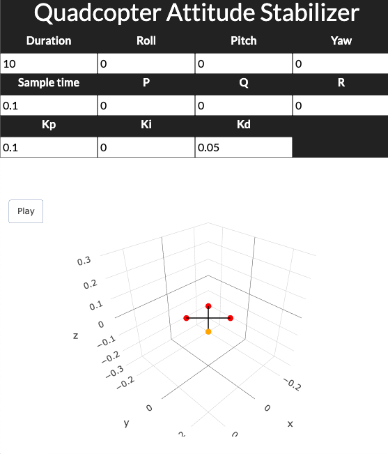

# ControlDashboard.jl

[](https://github.com/Mitchelldscott/ControlDashboard/actions/workflows/CI.yml)
[](https://app.codecov.io/gh/mitchelldscott/ControlDashboard)
<!-- [](https://MitchellDScott.github.io/ControlDashboard/) -->

`ControlDashboard.jl` is a Julia package for creating interactive control
system dashboards using [Dash.jl](https://dash.plotly.com/). It automatically
generates parameter panels from user-defined structs, runs simulations in real
time, and visualizes results with interactive [Plotly](https://plotly.com/)
figures — all within a web-based interface.

With `ControlDashboard.jl`, users can quickly prototype and explore dynamic
models by adjusting parameters, initial conditions, or control inputs directly
from the dashboard. Each update triggers a simulation of the provided system
model (e.g., differential equations), and the results are displayed through
customizable visualization tabs.

## Key Features

* **Automatic UI generation** – Build Dash input panels directly from Julia
structs.
* **Reactive simulation** – Register callbacks so that any parameter change
triggers a model re-run.
* **Seamless Plotly integration** – Display results in fully interactive
figures and layouts.
* **Customizable workflows** – Provide your own simulation functions, models,
and visualization components.

## Typical Use Case

Use `ControlDashboard.jl` when you want to:

* Prototype and visualize control systems interactively.
* Explore nonlinear dynamics by varying parameters in real time.
* Build educational or research tools that combine modeling, simulation, and
visualization.



## Getting Started

### 1. **Install Julia**

* Download and install from [julialang.org/downloads](https://julialang.org/downloads/).
* Recommended: Julia ≥ 1.11.

### 2. **Set up the environment**

```bash
git clone https://github.com/MitchellDScott/ControlDashboard.jl.git
cd ControlDashboard
julia --project=.
```

### 3. **Activate and instantiate dependencies**

```julia
using Pkg
Pkg.activate(".")
Pkg.instantiate()
```

### 4. **Run tests**

In a julia script/console:

```julia
include("test/runtests.jl")
```

or from the Julia REPL

```julia
julia> ]
(@v1.11) pkg> activate .
(ControlDashboard) pkg> test
```

### 5. **Run examples**

```bash
julia --project=. examples/sinusoid.jl
```

```bash
julia --project=. examples/quadcopter_attitude_stabilization.jl
```
